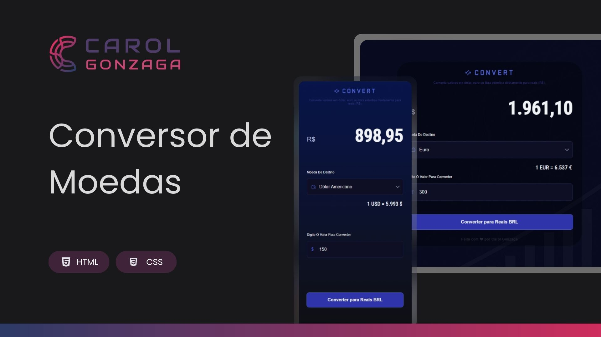

  

 

Um projeto de Conversor de Moedas com abordagem mobile-first e totalmente responsivo.

  <a href="#-tecnologias">Tecnologias</a>&nbsp;&nbsp;&nbsp;|&nbsp;&nbsp;&nbsp;<a href="https://carolgonzaga.github.io/conversor-de-moedas/">Acesse o Projeto</a>

 
 

  

 
 

## 🚀 Tecnologias

Esse projeto foi desenvolvido com as seguintes tecnologias:

- HTML5
- CSS3
- JavaScript

 
 

## 🎯 Objetivo

O objetivo deste projeto é colocar em prática os conhecimentos adquiridos em JavaScript por meio da construção de um conversor de moedas. A aplicação permite converter valores em dólar, euro ou libra esterlina para reais (BRL), com uma interface clara, responsiva e otimizada para dispositivos móveis.
